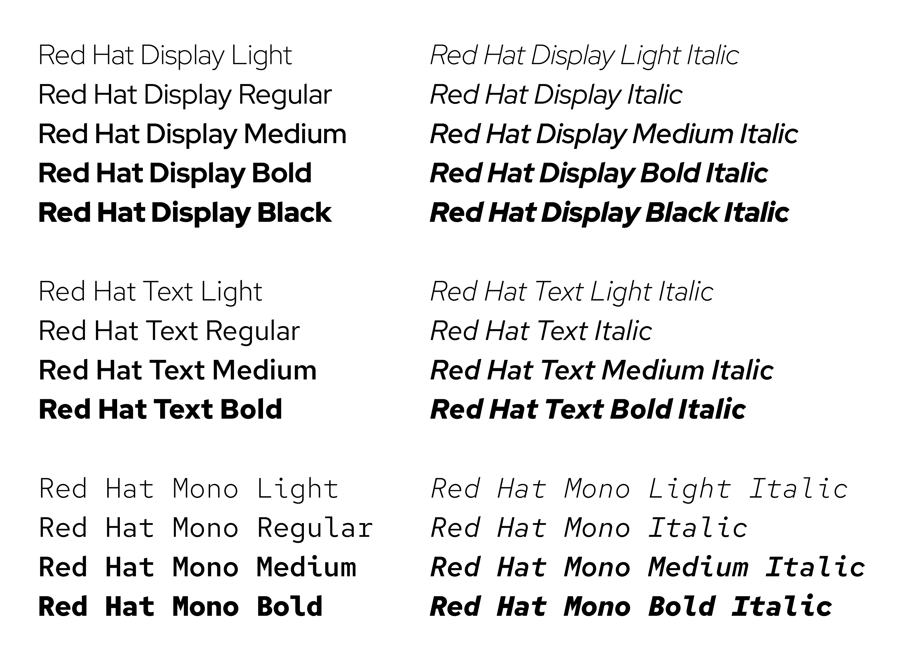

# Game Mania

This project simulates a game catalog by consuming
the [RAWG API](https://rawg.io/apidocs) for providing data visualization similar
to how actual game stores do.

## Summary

* [Dependencies](#dependencies)
    - [Production Dependencies](#production-dependencies)
    - [Development Dependencies](#development-dependencies)
* [Design System](#design-system)
    - [Prototyping](#prototyping)
    - [Palette](#palette)
    - [Typography](#typography)
* Project Structure
    - Assets
        - Fonts
    - Data
        - Context
            - [Root Context]
        - Local Storage
            - [Local Db]
        - Requests
            - [Data Request Params]
        - Types
            - [Added By Status]
            - [Data Service Dictionary]
            - [Developer]
            - [Esrb Rating]
            - [Game]
            - [Game Commons]
            - [Games Platform]
            - [Genre]
            - [Image]
            - [index]
            - [Local Db Store]
            - [Parent Platform]
            - [Platform]
            - [Publisher]
            - [Rating]
            - [Recommended]
            - [Screenshots]
            - [Short Screenshot]
            - [Store]
            - [Tag]
    - Middlewares
        - [Api Middleware]
    - Services
        - [Api Service]
        - [Game Service]
        - [Genre Service]
        - [Platform Service]
        - [Publishe Service]
        - [Tag Service]
    - Utils
        - [Local Db Utils]
        - [Parser Utils]
        - [Startup Utils]
        - [Styling Utils]
        - [Type Utils]
    - Views
        - Components
            - [Footer]
            - [Gallery]
            - [Game Card]
            - [Game Panel]
            - [Header]
            - [Image Card]
            - [Search Filter]
            - [Selection]
        - Pages
            - [Error Page]
        - Routes
            - [Game]
            - [Home]
            - [Root]
            - [Search]

---

## Dependencies

This project relies directly on the following dependencies:

### Production Dependencies

* axios: ^1.7.7
* react: ^18.3.1
* react-dom: ^18.3.1
* react-router-dom: ^6.26.2

### Development Dependencies

* @eslint/js: ^9.9.0
* @types/react: ^18.3.3
* @types/react-dom: ^18.3.0
* @typescript-eslint/eslint-plugin: ^8.7.0
* @typescript-eslint/parser: ^8.7.0
* @vitejs/plugin-react: ^4.3.1
* eslint: ^9.11.1
* eslint-plugin-react-hooks: ^5.1.0-rc.0
* eslint-plugin-react-refresh: ^0.4.9
* globals: ^15.9.0
* sass: ^1.79.3
* typescript: ^5.5.3
* typescript-eslint: ^8.0.1
* vite: ^5.4.1
* vite-tsconfig-paths: ^5.0.1

---

## Design System

This section provides information regarding the visual aspects of the project's
layout.

### Prototyping

A simple prototype as built using Figma for providing a general look of how the
application should be implemented. It can be found
on [the project's prototype link](https://www.figma.com/design/NuDXuXFtXRA7aBTbMXg4RA/PROT%C3%93TIPO-GAME-MANIA?node-id=0-1&t=w6hP0w9PStL1vvUt-1)

---

### Palette

Three base colors were chosen for building up the whole user interface. Along
with these base colors, many tones for each one were provided for applying
transitions, animations, gradients and so on. This palette was generated using
the [Coolors](https://coolors.co) utility.

```scss
$white: hsla(32, 100%, 97%, 1);
$white-d: hsla(34, 37%, 93%, 1);
$white-d1: hsla(34, 23%, 88%, 1);
$white-d2: hsla(34, 17%, 84%, 1);
$white-d3: hsla(32, 12%, 79%, 1);
$white-d4: hsla(37, 10%, 74%, 1);
$white-d6: hsla(35, 8%, 70%, 1);

$cyan: hsla(179, 78%, 52%, 1);
$cyan-d: hsla(179, 72%, 49%, 1);
$cyan-d1: hsla(179, 73%, 47%, 1);
$cyan-d2: hsla(179, 73%, 45%, 1);
$cyan-d3: hsla(179, 73%, 42%, 1);
$cyan-d4: hsla(179, 73%, 40%, 1);
$cyan-d5: hsla(179, 74%, 37%, 1);

$black: #221e22ff;
$black-d: #1d1a1dff;
$black-d1: #181518ff;
$black-d2: #131113ff;
$black-d3: #0d0c0dff;
$black-d4: #080808ff;
$black-d5: #030303ff;
```

These colors can be visualized in the pictures below:

#### White


#### Cyan


#### Black


---

### Typography

The entire project typography relies on
the [RedHat Display Font](https://github.com/RedHatOfficial/RedHatFont) only,
provided under the SIL Open Font license. All rights reserved.



---

## Project Structure

This section covers the logical aspects and implementations of the project
through its different layers, for making it work as the expected result.

The Game Mania project's file structure is provided as follows:

* [Assets](#assets)
* [Data](#data)
    - [Context](#context)
    - [Local Storage](#local-storage)
    - [Request Parameters](#request-parameters)
    - [Types](#types)
* [Middlewares]()
* [Services]()
* [Utils]()
* [Views]()

### Assets

Assets are static resources that can be used for multiple purposes within
the project. These may include either images, fonts, source text documents etc.

---

### Data

The `@src/data` namespace is meant for containing pieces of software that are
dominant
in the aspects of working with data. It is the namespace containing either
static data models, like types or interfaces, or data operations such as
context, for
global state management, and database abstractions.

#### Context

The `@data/context` module is responsible for providing global state
managements for data that is shared between various UI components of the
system.

The existing contexts in the project are:

* [Root Context](#root-context)

##### Root Context

The `RootContext` is responsible for providing common state management
across the whole application, providing data that is likely to be used
within any existing UI component, not restricted to a given component or an
application route, page or similar.

The data provided by the `RootContext` is defined within the `IRootContext`
interface:

```typescript
interface IRootContext {
	games?: Game[]
	genres?: Genre[]
	platforms?: Platform[]
	publishers?: Publisher[]
	selectedGame?: Game
	setGames: Dispatch<SetStateAction<Game[] | undefined>>
	setGenres: Dispatch<SetStateAction<Genre[] | undefined>>
	setPlatforms: Dispatch<SetStateAction<Platform[] | undefined>>
	setPublishers: Dispatch<SetStateAction<Publisher[] | undefined>>
	setSelectedGame: Dispatch<SetStateAction<Game | undefined>>
	setTags: Dispatch<SetStateAction<Tag[] | undefined>>
	tags?: Tag[],
	apiMiddleware?: IApiMiddleware
}
```

---

#### Local Storage

The `@data/local-storage` module is responsible for providing client-side
database operations. This module actually relies on the `IndexedDB` API
implementation of browsers, and is likely to be described as an abstraction
layer for simplifying access to the API.

The main representation of the module is the `LocalDb` class, which is an
implementation of the `ILocalDb` interface, providing a set of abstractions for
working more effectively with the `IndexedDB` API.

This abstraction was required due to the fact that the `IndexedDB` API was
specified within an era where Javascript `Promise`s didn't exist and, due to
such context, it relies on many callbacks for each internal request for the
database. Dealing with that API directly is not recommended, and may lead to
inconsistencies within the application.

The `ILocalDb` interface defines the behaviors implemented by the `LocalDb`
class, as follows:

```typescript
interface ILocalDb<T> {
	openObjectStore(storageName: string,
					mode: IDBTransactionMode
	): Promise<IDBObjectStore>

	create<T extends ApiData[]>(storages: { [K in keyof T]: LocalDbStore<T[K]> }): void

	getObjectById(storageName: string, key: number): Promise<T>

	getAll(storageName: string, params?: DataRequestParams): Promise<T[]>

	addObject(storageName: string, object: T): Promise<boolean>

	addBulk(storageName: string, objects: T[]): Promise<ApiData[]>

	removeObject(storageName: string, key: keyof T): Promise<boolean>

	updateObject(storageName: string,
				 key: keyof T,
				 newObject: T
	): Promise<boolean>

	isCreated(): boolean

	reset(): void
}
```

##### ILocalDb.openObjectStore

---

##### ILocalDb.create

---

##### ILocalDb.getObjectById

--- 

##### ILocalDb.getAll

---

##### ILocalDb.addObject

---

##### ILocalDb.addBulk

---

##### ILocalDb.removeObject

---

##### ILocalDb.updateObject

---

##### ILocalDb.isCreated

---

##### ILocalDb.reset

---

#### Request Parameters

Request parameters define the structure of the query parameters sent to the API
for retrieving data.
These parameters are defined within the `@data/requests` module.

At the moment, the existing request parameters are:

* [Data Request Params](#data-request-params)

##### Data Request Params

The `DataRequestParams` type defines the overall structure of the query
parameters sent to the API for retrieving data.
It is not meant for production, given most of its properties are only valid for
the `games` endpoint of the API, thus it is likely to be changed in the future.

```typescript
type DataRequestParams = {
	page?: number
	pageSize?: number
	search?: string
	searchPrecise?: boolean
	searchExact?: boolean
	parentPlatforms?: string
	platforms?: string
	stores?: string
	developers?: string
	publishers?: string
	genres?: string
	tags?: string
	creators?: string
	dates?: string
	updated?: string
	platformsCount?: number
	metacritic?: string
	excludeCollection?: number
	excludeAdditions?: boolean
	excludeParents?: boolean
	excludeGameSeries?: boolean
	excludeStores?: string
	ordering?: 'name' | 'released' | 'added' | 'created' | 'updated' | 'rating' | 'metacritic'
}
```` 

#### Types

The `@data/types` module is responsible for providing the data models used
within the project. These are meant to match either data provided directly by
API endpoints or internal data structures of such data.

The existing types in the project are, in alphabetical order:

* [Added By Status](#added-by-status)
* [Data Service Dictionary](#data-service-dictionary)
* [Developer](#developer)
* [Esrb Rating](#esrb-rating)
* [Game](#game)
* [Game Commons](#game-commons)
* [Games Platform](#games-platform)
* [Genre](#genre)
* [Image](#image)
* [Local Db Store](#local-db-store)
* [Parent Platform](#parent-platform)
* [Platform](#platform)
* [Publisher](#publisher)
* [Rating](#rating)
* [Recommended](#recommended)
* [Screenshots](#screenshots)
* [Short Screenshot](#short-screenshot)
* [Store](#store)
* [Tag](#tag)

##### Added By Status

The `AddedByStatus` type defines the structure of the `added_by_status` property
from `games` endpoint responses.

```typescript
type AddedByStatus = {
	yet: number
	owned: number
	beaten: number
	toplay: number
	dropped: number
}
```

---

##### Data Service Dictionary

The `DataServiceDictionary` type defines the structure of the dictionary used
for implementing the dynamic behavior of the `ApiService` class.

```typescript
type DataServiceDictionary = {
	games: IGameService
	genres: IDataService<Genre>
	platforms: IDataService<Platform>
	publishers: IDataService<Publisher>
	tags: IDataService<Tag>
}
```

---

##### Developer

The `Developer` type defines the structure of the `developer` property from
`games` endpoint responses.

```typescript
type Developer = {
	id: number
	name: string
	slug: string
	gamesCount: number
	imageBackground: string
}
```

---

##### Esrb Rating

The `EsrbRating` type defines the structure of the `esrb_rating` property from
`games` endpoint responses.

```typescript
type EsrbRating = {
	id: number
	name: string
	slug: string
}
```

---

##### Game

The `Game` type defines the structure of the `games/{id}` endpoint responses.

```typescript
type Game = GameCommons & {
	nameOriginal: string
	description: string
	metacriticPlatforms: unknown[]
	backgroundImageAdditional: string
	website: string
	screenshotsCount: number
	moviesCount: number
	creatorsCount: number
	achievementsCount: number
	parentAchievementsCount: number
	redditUrl: string
	redditName: string
	redditDescription: string
	redditLogo: string
	redditCount: number
	twitchCount: number
	youtubeCount: number
	alternativeNames: string[]
	metacriticUrl: string
	parentsCount: number
	additionsCount: number
	gameSeriesCount: number
	developers: Developer[]
	publishers: Publisher[]
	descriptionRaw: string
	shortScreenshots?: ShortScreenshot[]
}
```

---

##### Game Commons

The `GameCommons` type defines the common structure of the `games` endpoint
shared across both `games` and `games/{id}` responses.

```typescript
type GameCommons = {
	rating: number
	ratingTop: number
	ratings: Rating[]
	added: number
	addedByStatus: AddedByStatus
	playtime: number
	released: string
	tba: boolean
	updated: string
	backgroundImage: string
	id: number
	slug: string
	name: string
	metacritic: unknown
	reviewsTextCount: number
	ratingsCount: number
	suggestionsCount: number
	userGame: unknown
	reviewsCount: number
	saturatedColor: string
	dominantColor: string
	parentPlatforms: ParentPlatform[]
	platforms: GamesPlatform[]
	stores: Store[]
	genres: Genre[]
	tags: Tag[]
	esrbRating: EsrbRating
	clip: unknown
}
```

---

##### Games Platform

The `GamesPlatform` type defines the structure of records of data within the
`platforms` property from
`games` endpoint responses.

```typescript
type GamesPlatform = {
	platform: Platform
	releasedAt: string
	requirements: unknown
}
```

---

##### Genre

The `Genre` type defines the structure of or more records of the `genres`
endpoint responses.

```typescript
type Genre = {
	id: number
	name: string
	slug: string
	gamesCount: number
	imageBackground: string
}
```

---

##### Image

The `Image` type defines the structure of one or more data records within the
`results` property from `games/{id}/screenshots` endpoint responses.

```typescript
type Image = {
	id: number
	image: string
	hidden: boolean
	width: number
	height: number
}
```

---

##### Local Db Store

The `LocalDbStore` type defines the structure of the options used for creating
object stores within the `LocalDb` class.

```typescript
type LocalDbStore<T> = {
	name: string
	keyPath: keyof T
	autoIncrement?: boolean
	indices: StoreIndex<T>[]
}
```

---

##### Parent Platform

The `ParentPlatform` type defines the structure of one or more data records of
the `parent_platforms` property from `games` endpoint responses.

```typescript
export type ParentPlatform = {
	platform: {
		id: number
		name: string
		slug: string
	}
}
```

---

##### Platform

The `Platform` type defines the structure of the `platforms` endpoint responses.

```typescript
type Platform = {
	id: 1
	name: string
	slug: string
	image: string
	yearEnd: unknown
	yearStart: unknown
	gamesCount: number
	imageBackground: string
}
```

---

##### Publisher

The `Publisher` type defines the structure of either one or more data records of
the `publishers` endpoint responses or the `publishers` property from `games`
endpoint responses.

```typescript
type Publisher = {
	id: number
	name: string
	slug: string
	gamesCount: number
	imageBackground: string
}
```

---

##### Rating

The `Rating` type defines the structure of the `ratings` property from `games`

```typescript
type Rating = {
	count: number
	id: number
	percent: number
	title: string
}
```

---

##### Recommended

The `Recommended` type defines the structure of the project's recommendations
system

```typescript
type Recommended = {
	recent: Game
	daily: Game
	recentScreenshots: Screenshots
	dailyScreenshots: Screenshots
}
```

---

##### Screenshots

The `Screenshots` type defines the structure of the `games/{id}/screenshots`
endpoint responses.

```typescript
type Screenshots = {
	count: number
	next?: string
	previous?: string
	results: Image[]
}
```

---

##### Short Screenshot

The `ShortScreenshot` type defines the structure of the `short_screenshots`
property from `games/{id}` endpoint responses.

```typescript
type ShortScreenshot = {
	id: number
	image: string
}
```

---

##### Store

The `Store` type defines both the structure of one or more data records of the
`stores` property from `games` endpoint responses and the `stores` endpoint
responses.

```typescript
type Store = {
	id: number
	url: string
	store: {
		id: number
		name: string
		slug: string
		domain: string
		gamesCount: number
		imageBackground: string
	}
}
```

---

##### Store Index

The `StoreIndex` type defines the structure of the indices used for creating
object stores within the `LocalDb` class.

```typescript
type StoreIndex<T> = {
	index: keyof T
	options: IDBIndexParameters
}
```

---

##### Tag

The `Tag` type defines the structure of both one or more data records of the
`tags` property from `games` endpoint responses and the `tags` endpoint
responses.

```typescript
type Tag = {
	id: number
	name: string
	slug: string
	language: string
	gamesCount: number
	imageBackground: string
}
```

---

### Middlewares

The `@src/middlewares` module is responsible for providing middleware functions
for the application.

The existing middlewares in the project are:

* [Api Middleware](#api-middleware)

#### Api Middleware

The `ApiMiddleware` class is responsible for providing a middleware for
intercepting API requests and responses, providing a set of behaviors for
selecting between data provided locally or from the API.

The behavior of the `ApiMiddleware` class is defined within the `IApiMiddleware`
interface:

```typescript
export interface IApiMiddleware {
	getAll(route: keyof DataServiceDictionary,
		   params?: DataRequestParams
	): Promise<ApiData[]>

	getById(route: keyof DataServiceDictionary, id: number): Promise<ApiData>

	getRecommendations(): Promise<Recommended>
}
```

---

### Services

The `@src/services` module is responsible for providing services that handle
more logical aspects for the application, such as API connections.

The existing services in the project are:

* [Api Service](#api-service)
* [Game Service](#game-service)
* [Genre Service](#genre-service)
* [Platform Service](#platform-service)
* [Publisher Service](#publisher-service)
* [Tag Service](#tag-service)

#### Api Service

The `ApiService` class is responsible for providing a service for providing the
actual API connection for the application.

The behavior of the `ApiService` class is defined within the `IApiService`
interface:

```typescript
interface IApiService {
	createRouteUrl(route: string): string

	gameApi: AxiosInstance
}
```

---

#### Data Service

The `DataService` implementations are responsible for providing a service for
handling data operations for the application.

The behavior of a `DataService` class is defined within the `IDataService`
interface:

```typescript
interface IDataService<T> {
	getAll(params: DataRequestParams): Promise<T[]>

	getById(id: number): Promise<T>
}
```

--- 

#### Game Service

The `GameService` class is an implementation of `IDataService` responsible for
providing a service for handling `Game`
data operations for the application. `Game` data is provided by the `games`
endpoint of the API.

The behavior of the `GameService` class is defined within the `IGameService`,
extending the `IDataService` interface:

```typescript
interface IGameService extends IDataService<Game> {
	getScreenshots(id: number): Promise<Screenshots>
}
```

---

#### Genre Service

The `GenreService` class is an implementation of `IDataService` responsible for
providing a service for handling `Genre` data operations for the application.
`Genre` data is provided by both the `genres` endpoint of the API or as a property
of the `games` endpoint response.

---

#### Platform Service

The `PlatformService` class is an implementation of `IDataService` responsible
for providing a service for handling `Platform` data operations for the application.
`Platform` data is provided by both the `platforms` endpoint of the API or as a property of the `games` endpoint response.

---

### Utils

The `@src/utils` module is responsible for providing utility functions for the application. These functions are meant to be used for providing common behaviors across the application, or functionalities that are not directly related to the business logic of the application.

The existing utilities in the project are:

* [Local Db Utils](#local-db-utils)
* [Parser Utils](#parser-utils)
* [Startup Utils](#startup-utils)
* [Styling Utils](#styling-utils)
* [Type Utils](#type-utils)

#### Local Db Utils

The `LocalDbUtils` class is responsible for providing utility functions for the
`LocalDb` class.

The behavior of the `LocalDbUtils` class is defined within the `ILocalDbUtils`
interface:

```typescript
interface ILocalDbUtils {
	filterObjects(idbCursorRequest: IDBRequest,
				  resolve: (value: (ApiData[] | PromiseLike<ApiData[]>)) => void,
				  results: ApiData[],
				  params?: DataRequestParams
	): void
}
```

---

#### Parser Utils

The `ParserUtils` class is responsible for providing utility functions for
parsing data either from or to the API. These functions are meant for providing
a more consistent behavior for the application, as the API may provide data in
different formats.

The behavior of the `ParserUtils` class is defined within the `IParserUtils`
interface:

```typescript
interface IParserUtils {
	mapToCamelCase(data: any): unknown
	mapToSnakeCase(data: any): unknown
	toCamelCase(snakeText: string): string
	toSnakeCase(camelText: string): string
}
```

---

#### Startup Utils

The `StartupUtils` class is responsible for providing utility functions for
starting up the application. These functions are meant for setting up the initial state of the application, such as initializing the database, etc.

The behavior of the `StartupUtils` class is defined within the `IStartupUtils`
interface:

```typescript
interface IStartupUtils {
	initializeDb(db: LocalDb): void
}
```

---

#### Styling Utils

The `StylingUtils` class is responsible for providing utility functions for the
styling of the application. These functions are meant for providing a more flexible way of styling the application, as some styles may be dependent on the application's state, which can't be defined statically.

The behavior of the `StylingUtils` class is defined within the `IStylingUtils`
interface:

```typescript
interface IStylingUtils {
	getInlineBanner(game?: Game): InlineBannerStyle
}
```

---

#### Type Utils

The `TypeUtils` class is responsible for providing utility functions for the type system of the application. These functions are meant for providing a more consistent behavior for the application, as the type system may be complex and require some additional behaviors for working effectively.

The behavior of the `TypeUtils` class is defined within the `ITypeUtils` interface:

```typescript
interface ITypeUtils {
	mapToGame(data: any): Game
	mapToStores(stores: Store[]): Store[]
	mapToGamesPlatforms(platforms: GamesPlatform[]): GamesPlatform[]
}
```

---

### Views

The `@src/views` module is responsible for providing the views of the application. These views are meant for providing the actual user interface of the application, and are composed of TSX functional components.

The views are divided into three main categories:
* [Components](#components): Reusable components that can be used across multiple pages.
* [Pages](#pages): Components that represent a single page of the application.
* [Routes](#routes): Components that represent a single route of the application.

#### Components

The `@src/views/components` module is responsible for providing reusable components that can be used across multiple pages of the application. These are highly dependent on the application's state, meaning that they make no sense by themselves, but only when used within a page/route.

The existing components in the project are:
* [Footer](#footer)
* [Gallery](#gallery)
* [Game Card](#game-card)
* [Game Panel](#game-panel)
* [Header](#header)
* [Image Card](#image-card)
* [Search Filter](#search-filter)
* [Search Widget](#search-widget)
* [Selection](#selection)

#### Pages

The `@src/views/pages` module is responsible for providing components that represent a single page of the application. These components are independent of the application's state, meaning that they can be used by themselves at any given route.

The existing pages in the project are:
* [Error Page](#error-page)

#### Routes

The `@src/views/routes` module is responsible for providing components that represent a single route of the application. These components are the main containers for both components and pages, and are meant for providing the actual user interface of the application. Routes are highly dependent on the application's state, but different from components, they are meant for dealing directly with the application's state, usually by using React's context API.

The existing routes in the project are:
* [Game](#game)
* [Home](#home)
* [Root](#root)
* [Search](#search)
